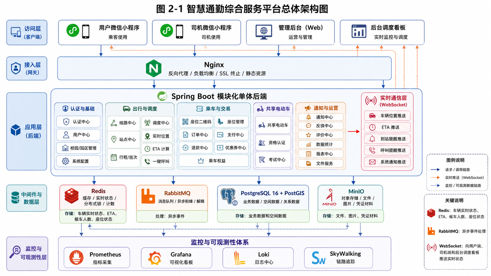
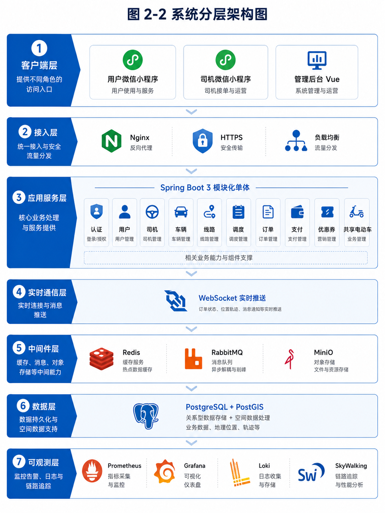
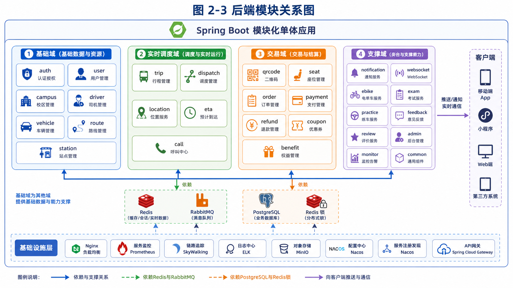
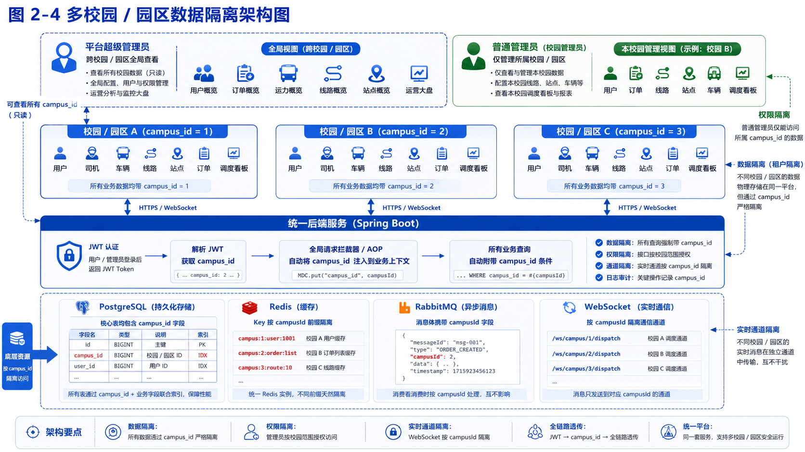
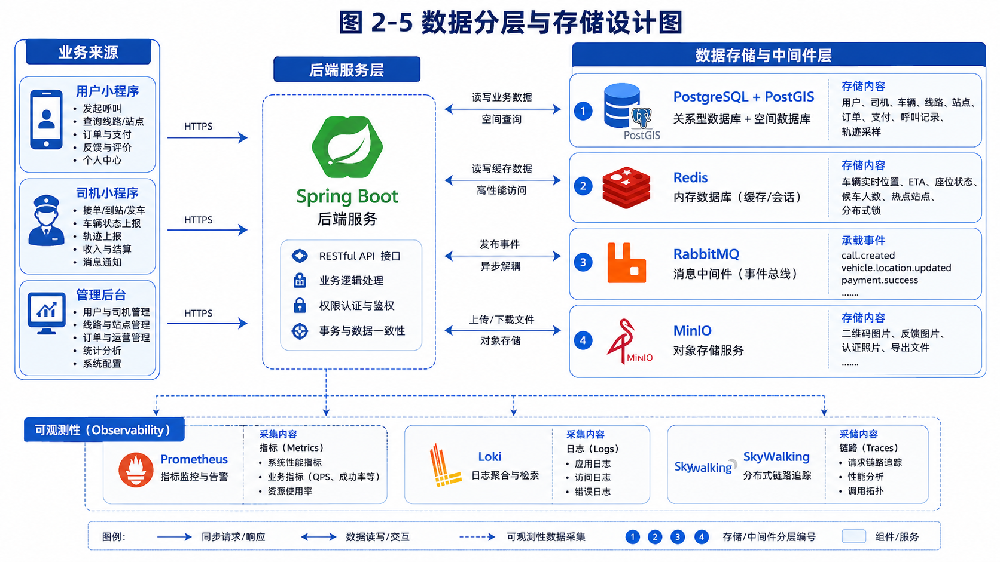

# 02-architecture-design.md

# 智慧通勤综合服务平台架构设计（Codex 开发版）

> 本文档是给 Codex 和开发人员使用的架构约束文档。  
> 目标是明确技术栈、模块边界、数据存储规则、实时数据处理方式、核心业务流程和开发硬约束。  
> 汇报用图、图片提示词、长图注请放到 `docs/02-architecture-diagrams.md` 或 `docs/02-architecture-report.md`，不要放在本文档中。

---

## 1. 架构结论

本项目采用 **模块化单体架构**，第一阶段不直接拆分微服务。

后端使用 `Spring Boot 3 + Java 17/21`，在一个后端工程内按业务领域拆分模块。系统通过 `Redis` 支撑车辆实时状态、ETA、候车人数、座位状态等高频实时数据，通过 `RabbitMQ` 处理异步事件，通过 `WebSocket` 向用户端、司机端和管理后台推送实时状态，通过 `PostgreSQL + PostGIS` 存储业务数据和空间数据。

系统必须支持 **多校园 / 多园区**。所有核心业务数据、缓存 Key、消息体和 WebSocket 通道都必须带 `campus_id` 或等价的校园隔离字段。

---

## 2. 技术栈

### 2.1 后端

- Java 17 / Java 21
- Spring Boot 3
- Spring Security
- MyBatis-Plus
- Spring Validation
- Spring WebSocket
- Spring Scheduler
- Redisson
- Spring AMQP

### 2.2 数据库与中间件

- PostgreSQL 16
- PostGIS
- Redis 7
- RabbitMQ
- MinIO

### 2.3 前端

- 用户端：微信原生小程序
- 司机端：微信原生小程序
- 管理后台：Vue 3 + TypeScript + Ant Design Vue

### 2.4 地图与定位

- 腾讯地图
- 小程序定位能力
- 后台地图调度看板使用腾讯地图 Web 能力

### 2.5 部署与可观测性

- Nginx
- Docker Compose
- Prometheus
- Grafana
- Loki
- SkyWalking

第一阶段使用 Docker Compose 部署，后期预留 Kubernetes、Redis Cluster、RabbitMQ 集群、PostgreSQL 主从或云数据库的升级空间。

---

## 3. 架构目标

本系统面向校园 / 园区通勤场景，必须满足以下目标：

1. 支持用户小程序、司机小程序、管理后台三类入口。
2. 支持线路、站点、车辆、司机、行程、订单、支付、优惠券、共享电动车资格等业务。
3. 支持车辆实时位置、ETA、候车人数、座位状态的实时展示。
4. 支持扫码乘车、座位二维码、订单支付、下车站点选择、到站提醒。
5. 支持一键呼叫，表达当前站点候车需求。
6. 支持多校园 / 多园区数据隔离。
7. 支持高峰场景下的高并发访问。
8. 支持监控、日志、链路追踪和告警。
9. 代码结构必须便于后期拆分微服务，但第一版不直接微服务化。

---

## 4. 总体架构

```text
用户微信小程序
司机微信小程序
管理后台 Vue
        |
      Nginx
        |
Spring Boot 3 模块化单体后端
        |
------------------------------------------------
| PostgreSQL + PostGIS | Redis | RabbitMQ | MinIO |
------------------------------------------------
        |
------------------------------------------------
| Prometheus | Grafana | Loki | SkyWalking        |
------------------------------------------------
```

系统核心链路：

```text
请求入口：
客户端 -> Nginx -> Spring Boot 后端

业务数据：
Spring Boot -> PostgreSQL + PostGIS

实时状态：
Spring Boot -> Redis

异步事件：
Spring Boot -> RabbitMQ -> 消费者

实时推送：
Spring Boot / 消费者 -> WebSocket -> 用户端 / 司机端 / 管理后台

文件对象：
Spring Boot -> MinIO

可观测性：
Spring Boot / 中间件 -> Prometheus / Loki / SkyWalking -> Grafana
```

---

## 5. 后端模块划分

后端使用模块化单体。所有模块放在同一个 Spring Boot 工程中，但包结构必须清晰。

```text
backend
├── auth              # 登录、认证、JWT、权限
├── user              # 用户管理
├── campus            # 校园 / 园区管理
├── driver            # 司机管理
├── vehicle           # 车辆管理
├── route             # 线路管理
├── station           # 站点管理
├── trip              # 行程 / 班次 / 任务
├── dispatch          # 调度
├── location          # 车辆定位
├── eta               # ETA 预计到站
├── call              # 一键呼叫
├── qrcode            # 座位二维码
├── seat              # 座位状态
├── order             # 订单
├── payment           # 支付
├── refund            # 退款
├── coupon            # 优惠券
├── benefit           # 乘车次数权益
├── notification      # 通知提醒
├── websocket         # 实时推送
├── ebike             # 共享电动车
├── exam              # 线上考试
├── practice          # 线下实操认证
├── feedback          # 问题反馈
├── review            # 司机评价
├── admin             # 管理后台接口
├── monitor           # 业务监控指标
└── common            # 公共能力
```

### 5.1 模块依赖规则

1. `common` 可以被所有模块依赖。
2. `auth` 提供认证和权限能力，不应依赖具体业务模块。
3. `campus` 提供多校园基础能力。
4. `vehicle`、`route`、`station` 是实时调度和订单业务的基础数据模块。
5. `location`、`eta`、`call` 属于实时调度域，主要依赖 Redis 和 RabbitMQ。
6. `order`、`payment`、`seat`、`coupon` 属于交易域，必须保证幂等和一致性。
7. `websocket` 只负责推送，不应直接写复杂业务状态。
8. 不允许跨模块直接访问其他模块的数据库表 Mapper，必须通过 Service 或 Domain API 调用。

---

## 6. 多校园 / 多园区设计

系统必须从第一版开始支持多个校园 / 园区。

### 6.1 数据库隔离

所有核心业务表必须包含：

```text
campus_id
```

必须包含 `campus_id` 的表包括但不限于：

```text
users
drivers
vehicles
routes
stations
route_stations
trips
driver_tasks
seat_qrcodes
orders
payments
refunds
coupons
user_coupons
ride_records
call_records
arrival_confirmations
vehicle_exceptions
driver_attendance
feedbacks
driver_reviews
ebike_vehicles
ebike_qualifications
exam_records
practice_records
```

所有业务查询必须自动带上 `campus_id` 条件。普通校园管理员只能访问本校园数据。平台超级管理员可以跨校园查看和管理。

### 6.2 请求上下文

登录成功后，JWT 中必须包含：

```text
userId
role
campusId
```

后端需要在请求入口解析 JWT，并写入 `CampusContext`。

业务代码禁止手动猜测 campusId，必须从认证上下文获取。

### 6.3 Redis 隔离

所有 Redis Key 必须带校园前缀：

```text
campus:{campusId}:vehicle:{vehicleId}:state
campus:{campusId}:vehicle:{vehicleId}:location
campus:{campusId}:vehicle:{vehicleId}:seats
campus:{campusId}:route:{routeId}:vehicles
campus:{campusId}:station:{stationId}:waiting_count
campus:{campusId}:station:{stationId}:call_users
campus:{campusId}:hot_station_rank
campus:{campusId}:driver:{driverId}:online
campus:{campusId}:trip:{tripId}:running
campus:{campusId}:user:{userId}:call_limit:{stationId}
```

### 6.4 RabbitMQ 消息隔离

所有消息体必须包含：

```json
{
  "eventId": "EVT_xxx",
  "eventType": "payment.success",
  "campusId": "1",
  "traceId": "trace_xxx",
  "occurredAt": "2026-06-24T10:30:00",
  "payload": {}
}
```

消费者必须根据 `campusId` 处理数据，禁止跨校园消费后写错数据。

### 6.5 WebSocket 隔离

WebSocket 频道必须按校园隔离：

```text
/ws/campus/{campusId}/route/{routeId}
ws:campus:{campusId}:vehicle:{vehicleId}
ws:campus:{campusId}:station:{stationId}
ws:campus:{campusId}:admin:dispatch_dashboard
ws:campus:{campusId}:user:{userId}
ws:campus:{campusId}:driver:{driverId}
```

---

## 7. 数据存储边界

### 7.1 PostgreSQL + PostGIS 存储内容

PostgreSQL 存储长期业务数据、交易数据、可追溯记录和空间基础数据。

必须存 PostgreSQL 的数据：

```text
用户信息
司机信息
车辆基础信息
线路信息
站点信息
线路站点关系
行程 / 班次 / 任务
座位二维码
订单
支付记录
退款记录
优惠券
用户优惠券
乘车记录
一键呼叫记录
司机到站确认记录
异常上报
司机考勤
问题反馈
司机评价
共享电动车资格
线上考试记录
线下实操记录
车辆轨迹采样
操作日志
```

### 7.2 Redis 存储内容

Redis 存储高频变化、短期有效、实时展示的数据。

必须存 Redis 的数据：

```text
车辆实时位置
车辆在线状态
车辆当前速度
车辆当前方向
车辆当前线路
车辆当前行程
ETA
站点当前候车人数
热点站点排行
座位实时状态
司机在线状态
用户防重复呼叫标记
座位锁
接口限流计数
验证码 / 临时状态
```

### 7.3 RabbitMQ 承载内容

RabbitMQ 承载异步事件，不保存最终业务状态。

核心事件包括：

```text
call.created
station.waiting_count.changed
vehicle.location.updated
vehicle.eta.updated
order.created
payment.success
payment.failed
seat.status.changed
trip.arrival.confirmed
arrival.reminder.triggered
refund.requested
refund.success
coupon.used
benefit.granted
```

### 7.4 MinIO 存储内容

MinIO 存储文件对象。

包括：

```text
座位二维码图片
反馈图片
共享电动车认证照片
线下实操照片
导出文件
报表文件
系统附件
```

数据库只保存文件元数据和 URL，不直接保存大文件内容。

---

## 8. 实时车辆数据设计

### 8.1 车辆位置上报原则

车辆实时位置不允许每次都写入数据库。

正确流程：

```text
司机端每 3～5 秒上报位置
        |
后端校验司机身份、车辆绑定、行程状态
        |
写 Redis 最新车辆位置和在线状态
        |
发布 vehicle.location.updated 到 RabbitMQ
        |
立即返回成功
        |
异步计算 ETA、WebSocket 推送、轨迹采样入库
```

### 8.2 轨迹采样

车辆轨迹可以采样入库，但不能全量高频入库。

建议规则：

```text
每 30～60 秒对运行中的车辆采样一次轨迹
轨迹采样表用于投诉追溯、运营分析、历史轨迹回放
实时地图展示只能使用 Redis 最新位置
```

### 8.3 离线判断

建议规则：

```text
超过 30 秒未上报：位置延迟
超过 60 秒未上报：车辆疑似离线
超过 120 秒未上报：车辆离线并触发后台告警
```

---

## 9. 一键呼叫设计

一键呼叫是业务事件，必须写数据库留痕，同时用 Redis 做实时计数。

### 9.1 同步流程

```text
用户点击一键呼叫
        |
获取用户定位
        |
校验用户是否登录
        |
校验 campus_id
        |
校验是否在站点候车范围
        |
检查 Redis 防重复呼叫
        |
写入 PostgreSQL call_records
        |
Redis 增加 station waiting_count
        |
发布 call.created 到 RabbitMQ
        |
返回呼叫成功
```

### 9.2 异步流程

```text
call.created
        |
通知司机端
        |
刷新后台调度看板
        |
更新候车热力图
        |
判断热点站点
        |
写运营统计
```

### 9.3 存储规则

```text
call_records：保存每次呼叫明细，用于追溯、投诉、统计、运营分析。
Redis waiting_count：保存当前站点候车人数，用于实时展示和调度。
Redis call_limit：防止同一用户短时间重复呼叫。
RabbitMQ call.created：异步通知司机、后台和统计服务。
```

禁止使用数据库 `count(*)` 作为当前站点候车人数的实时来源。

---

## 10. 扫码乘车与支付设计

### 10.1 第一版支付策略

第一版先实现模拟支付，后期再接微信支付。

模拟支付也必须按真实支付链路设计：

```text
扫码
校验
锁座
创建订单
模拟支付成功
更新订单状态
更新支付记录
更新座位状态
生成乘车记录
异步通知和统计
```

### 10.2 扫码乘车流程

```text
用户扫描座位二维码
        |
后端校验二维码是否有效
        |
校验车辆是否存在
        |
校验车辆是否处于运行中
        |
校验行程是否有效
        |
校验座位是否可用
        |
Redis / Redisson 加座位锁
        |
创建订单
        |
返回支付确认
        |
支付成功
        |
更新订单状态
        |
更新支付记录
        |
更新座位状态
        |
生成乘车记录
        |
发布 payment.success 和 seat.status.changed
        |
WebSocket 推送座位状态
```

### 10.3 强一致要求

以下操作必须在同步事务或强一致链路中完成：

```text
二维码校验
座位可用性校验
座位锁定
订单创建
支付状态更新
支付记录写入
座位状态更新
优惠券核销
```

以下操作可以异步：

```text
发送通知
运营统计
乘车次数累计
权益发放
后台看板刷新
报表统计
```

### 10.4 幂等要求

必须保证：

```text
同一个二维码重复扫码不会重复创建有效订单
同一个座位同一时间只能被一个订单占用
支付回调重复到达不会重复更新状态
同一个优惠券不能重复核销
同一个 payment.success 不会重复生成乘车记录
```

---

## 11. 订单状态机

订单状态必须使用状态机控制，禁止随意更新状态。

状态：

```text
CREATED      已创建
PAYING       支付中
PAID         已支付
RIDING       乘车中
COMPLETED    已完成
CANCELLED    已取消
FAILED       支付失败
REFUNDING    退款中
REFUNDED     已退款
```

合法流转：

```text
CREATED -> PAYING
PAYING -> PAID
PAYING -> FAILED
CREATED -> CANCELLED
PAID -> RIDING
RIDING -> COMPLETED
PAID -> REFUNDING
COMPLETED -> REFUNDING
REFUNDING -> REFUNDED
```

禁止非法回退，例如：

```text
COMPLETED -> PAID
REFUNDED -> PAID
CANCELLED -> PAID
```

所有状态更新必须幂等。

---

## 12. 座位状态机

座位状态：

```text
AVAILABLE    可用
LOCKED       锁定中
OCCUPIED     已占用
DISABLED     不可用
```

合法流转：

```text
AVAILABLE -> LOCKED
LOCKED -> OCCUPIED
LOCKED -> AVAILABLE
OCCUPIED -> AVAILABLE
AVAILABLE -> DISABLED
OCCUPIED -> DISABLED
DISABLED -> AVAILABLE
```

规则：

```text
用户扫码后，座位从 AVAILABLE 变为 LOCKED。
支付成功后，座位从 LOCKED 变为 OCCUPIED。
支付失败或订单超时后，座位从 LOCKED 变为 AVAILABLE。
用户下车或行程结束后，座位从 OCCUPIED 变为 AVAILABLE。
管理员可以将座位设置为 DISABLED。
```

座位状态必须通过 Redis / Redisson 锁防止并发占用。

---

## 13. ETA 与到站提醒设计

### 13.1 ETA 计算

ETA 由车辆位置事件触发，结果写入 Redis。

输入：

```text
车辆当前位置
车辆速度
线路轨迹
站点顺序
车辆运行方向
历史平均速度
司机到站确认记录
```

输出：

```text
下一站 ETA
用户候车站 ETA
车辆到各站点 ETA
```

第一版允许粗略估算，不要求公交级高精度。

### 13.2 到站提醒

用户支付后可以选择下车站点并开启到站提醒。

触发条件：

```text
ETA 小于设定阈值
车辆进入目标站点范围
司机点击到站确认
```

提醒方式：

```text
小程序消息
页面弹窗
手机震动
WebSocket 实时提醒
```

---

## 14. RabbitMQ 设计

### 14.1 Exchange 建议

```text
call.exchange
vehicle.exchange
payment.exchange
seat.exchange
trip.exchange
refund.exchange
coupon.exchange
notification.exchange
stat.exchange
```

### 14.2 消息体规范

所有消息必须包含：

```json
{
  "eventId": "EVT_202606240001",
  "eventType": "call.created",
  "version": "1.0",
  "campusId": "1",
  "traceId": "trace_xxx",
  "source": "call-service",
  "occurredAt": "2026-06-24T10:30:00",
  "payload": {}
}
```

### 14.3 消费者要求

消费者必须满足：

```text
幂等消费
失败重试
死信处理
记录消费日志
不得假设消息只会投递一次
不得因为重复消息生成重复业务数据
```

建议使用：

```text
eventId + consumerName 作为消费幂等键
业务唯一索引防止重复写入
状态机防止重复状态流转
```

---

## 15. WebSocket 设计

WebSocket 用于实时推送：

```text
车辆位置
ETA
候车人数
座位状态
一键呼叫提醒
热点站点提醒
到站提醒
后台调度看板数据
```

订阅维度：

```text
campus_id
route_id
vehicle_id
station_id
user_id
driver_id
admin_dashboard
```

禁止把 WebSocket 当成核心业务状态来源。WebSocket 只负责推送，业务状态以 PostgreSQL / Redis 为准。

---

## 16. 后台地图调度看板设计

后台地图调度看板的数据来源：

```text
PostgreSQL：
车辆基础信息、线路、站点、司机、订单、呼叫记录、行程任务

Redis：
车辆实时位置、ETA、候车人数、座位状态、热点站点、在线状态

RabbitMQ：
车辆位置事件、呼叫事件、座位状态事件、异常事件

WebSocket：
实时推送到管理后台
```

看板展示内容：

```text
车辆实时位置
车辆所属线路
线路轨迹
站点分布
候车人数
热点站点
ETA
车辆座位总数
车辆空座数
车辆已占座数
异常车辆
司机状态
```

---

## 17. 共享电动车资格认证设计

共享电动车模块第一版重点实现：

```text
共享电动车入口
车辆展示
用户资格状态
线上考试
线下实操审核
资格冻结 / 解冻
资格有效期
```

资格状态：

```text
UNVERIFIED       未认证
EXAM_PENDING     待考试
EXAM_FAILED      考试未通过
EXAM_PASSED      考试已通过
PRACTICE_PENDING 待线下实操
PRACTICE_FAILED  实操未通过
APPROVED         认证通过
FROZEN           资格冻结
EXPIRED          资格过期
```

未认证、冻结、过期用户不能使用共享电动车。

---

## 18. 认证与权限设计

认证方式：

```text
JWT
RBAC
campus_id 数据隔离
操作日志审计
```

角色建议：

```text
PASSENGER           乘客
DRIVER              司机
CAMPUS_ADMIN        校园管理员
OPERATOR            运营人员
SUPER_ADMIN         平台超级管理员
```

权限要求：

```text
乘客只能访问用户端功能和自己的数据
司机只能访问司机端功能和自己的任务
校园管理员只能访问本校园数据
平台超级管理员可以跨校园管理
所有后台敏感操作必须记录审计日志
```

---

## 19. 可观测性设计

必须接入：

```text
Prometheus
Grafana
Loki
SkyWalking
```

### 19.1 业务指标

必须监控：

```text
在线车辆数
车辆位置延迟数
车辆离线数
司机在线数
WebSocket 连接数
扫码订单数
支付成功率
支付失败率
一键呼叫次数
站点候车人数
ETA 计算失败次数
RabbitMQ 消息积压
Redis 命中率
数据库连接池使用率
接口 P95 响应时间
接口错误率
```

### 19.2 日志要求

关键日志必须包含：

```text
traceId
campusId
userId
driverId
vehicleId
routeId
stationId
orderId
eventId
```

---

## 20. 部署设计

第一阶段使用 Docker Compose。

服务建议：

```text
nginx
backend
admin-web
postgresql
redis
rabbitmq
minio
prometheus
grafana
loki
promtail
skywalking-oap
skywalking-ui
```

要求：

```text
数据库必须挂载持久化 volume
Redis 必须配置持久化或至少主从策略
RabbitMQ 数据必须持久化
MinIO 数据必须持久化
日志必须统一采集
必须提供备份脚本
```

---

## 21. Codex 开发硬约束

Codex 生成代码时必须遵守以下规则：

1. 不允许把车辆实时位置每次都写入数据库。
2. 不允许用数据库 `count(*)` 实时统计候车人数。
3. 一键呼叫必须写 `call_records` 留痕，同时用 Redis 做当前候车人数。
4. 所有核心表必须包含 `campus_id`。
5. 所有业务查询必须带 `campus_id` 隔离。
6. 所有 Redis Key 必须带 `campus:{campusId}:` 前缀。
7. 所有 RabbitMQ 消息必须包含 `eventId`、`traceId`、`campusId`。
8. 所有 MQ 消费者必须幂等。
9. 扫码乘车必须使用 Redis / Redisson 座位锁。
10. 订单状态必须使用状态机，不允许随意更新。
11. 座位状态必须使用状态机，不允许非法流转。
12. 支付回调必须幂等。
13. 优惠券核销必须防重复。
14. WebSocket 只负责推送，不作为最终状态来源。
15. 文件必须存 MinIO，数据库只存文件元数据和 URL。
16. 后台管理接口必须做 RBAC 权限校验。
17. 平台必须记录关键操作审计日志。
18. 不允许把未来微服务复杂度提前引入第一版。
19. 第一版以模块化单体实现，目录结构必须清晰。
20. 所有核心异常必须有日志和 traceId。

---

## 22. 禁止事项

禁止以下实现方式：

```text
禁止车辆实时位置每次直接入库。
禁止实时地图每次都查 PostgreSQL。
禁止当前候车人数通过数据库实时 count。
禁止一键呼叫只存 Redis 不入库。
禁止扫码支付不加座位锁。
禁止支付回调无幂等。
禁止订单状态随意字符串更新。
禁止座位状态无状态机。
禁止 Redis Key 不带 campusId。
禁止 MQ 消息不带 eventId。
禁止 WebSocket 推送跨 campus。
禁止后台管理员跨 campus 访问数据。
禁止将大文件直接存数据库。
禁止第一版直接拆成多个微服务。
```

---

## 23. 架构图引用位置

本文档仅保留必要图引用，不保存图片提示词。

```markdown









```

图片提示词、完整图注和汇报说明请维护在：

```text
docs/02-architecture-diagrams.md
docs/02-architecture-report.md
```
